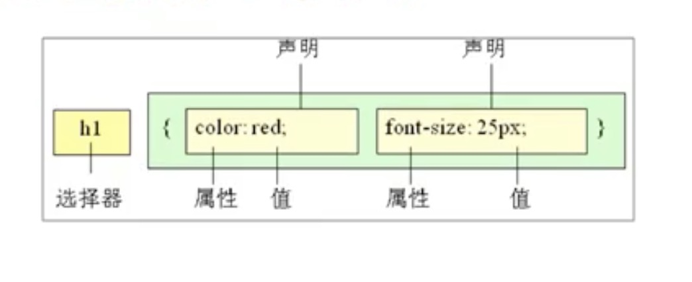
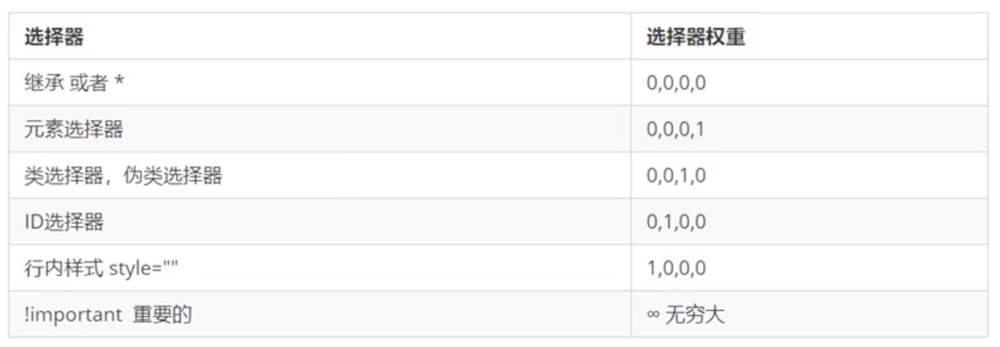

## 基础概念

- CSS(Cascading Style Sheets) 层叠样式表
- 也是一种标记语言
- 用来设置HTML中文字(字体、大小、颜色、对齐方式)，图片(宽高、边框样式、边距)，版面的布局以及外观显示样式等

- 选择器 + 一条或者多条声明样式



- style标签
- 工具
  - snipate  截图工具


## CSS

### 选择器

- 选择器作用：根据不同需求把不同标签选择出来

- 基础选择器  ----单个选择器

  - 标签选择器

  - 类选择器    可以单独选择其中的一个或几个标签，差异化选择  类名有规范，要注意，一个标签可以有多个类名

    ```
    .类名 {
    	xx: xx
    }
    在标签内增加class属性
    ```

  - id选择器    

  ```
  #id名 {
  	xx: xx
  }
  在标签内增加id属性
  ```

  - 通配符选择器

  ```
  * {     // 所有的标签
  	xx: xx
  }
  ```

  

  - id选择器和类选择器有什么区别
    - id选择器只能调用一次，别人切勿使用，因为id要保证唯一

- 复合选择器

  - 更准确、更高效地选择目标元素
  - 两个或多个基础选择器进行组合
  - 后代选择器、子选择器、并集选择器、伪类选择器

  - 后代选择器(重要)
    - 又称为包含选择器，可以选择父元素里面的子元素
    - 元素1 元素2 {样式说明}
  - 子选择器
    - 子元素选择器，选择最近一级的子元素(亲儿子)
    - 元素1>元素2 {样式说明}
  - 并集选择器
    - 可以选择多组标签，定义相同样式
    - 元素1,元素2 {样式说明}  一般都竖着写
  - 伪类选择器
    - 添加特殊效果，比如给链接添加特殊效果   链接伪类、结构伪类、表单伪类
    - :元素{样式说明}
    - 链接伪类选择器
      - a:link 选择所有未被访问的链接
      - a:visvited 选择所有已被访问的链接
      - a:hover 选择鼠标位于其上的链接
      - a:active 选择活跃链接(鼠标按下为弹起的链接)
      - 确保生效，按照LVHA的顺序书写
      - 实际开发，一般给a设置一个样式，再给a:hover设置一个样式
    - :focus伪类选择器
      - 获得焦点(光标)的表单元素，主要针对input表单


### font

- font-family  字体  
- font-size  大小     标题标签单独设置，注意px单位     默认16px
- font-weight  文本粗细    bold(700)  normal(400)
- font-style  字样  正常/斜体（italic）

复合写法，不需要的属性可以省略，但是font-size和font-family必须保留

```
div {
	font: font-style font-weight font-size/line-height font-family  注意顺序不能变
}
```


### 文本属性

- 颜色、对齐方式、装饰效果、缩进、行间距

- 颜色(color)
  - 英语、#16进制、rgb(x,x,x)      16进制最常用
- 对齐文本(text-align)
  - left、right、center
- 装饰文本(text-decoration)
  - none、underline、overline（几乎不用）、line-through（删除线）
- 文本缩进(text-indent)
  - 段落首行缩进    可以用px，推荐用em（相对大小） 一般2em（两个文字大小）
- 行间距(line-height)
  - 控制行与行之间的距离
  - 行高 = 文字高度+上下间距
- 垂直居中
  - 小技巧实现  让文字的行高等于盒子的高度

### CSS引入方式

- 行业样式表(行内式)  适合简单样式修改   在标签内部设置style属性

  ```
  <p style="color: red;font-size: 26px;">测试文字</p>
  ```

- 内部样式表(嵌入式)   放到<style>标签中，理论上可以放到任意位置，一般放到head标签下 控制整个页面

- 外部样式表(链接式)   css文件引入到html,通过link引入

  ```
  <link rel="stylesheet" href="css文件路径">  在head标签下写
  ```

  

### Emmet语法

- ！ 生成html骨架

- 生成标签   标签名+tab
- 生成多个相同的标签   div*10  ===>  10个div
- 父子级关系标签   ul > li
- 兄弟关系 div+p
- 给标签加id或class    .nav   #nav  p.one       .demo$*5  ==>class 自增 demo1==>demo5
- 生成的标签默认带文字   div{xxxxx}    div{$}*5   
- w200 ===> width:200px  等等

```
在保存代码的时候自动格式化代码
设置(左下角)
搜索emmet.include
在setting.json下的用户中添加
"editor.formatOnType": true,
"editor.formatOnSave": true
```


### 元素显示模式

- 元素以什么样的方式进行显示

  - 块元素，比如div
    - 独占一行
    - 高度、宽度、内外边距都可以控制    ====>盒子模型
    - 宽度默认是容器（父级宽度）的100%
    - 是一个容器级盒子，可以放行内或块级元素
    - 文字类块级标签(p,h1~h6)不允许放其他块级元素
  - 行内元素，比如span
    - 相邻行内元素在一行上，一行可以显示多个
    - 高、宽直接设置是无效的
    - 默认宽度就是本身内容的宽度
    - 行内元素智能容纳文本或其他行内元素
    - a里面不能再放a，但是a里面可以放块级元素
  - 行内块元素  img、input、td  同时具有块、行内元素的特点
    - 相邻行内元素在一行上，但是之间有空隙
    - 默认宽度就是本身内容的宽度
    - 高度、宽度、内外边距都可以控制 
  - 元素显示模式的转换   block（块级）、inline（行内）、inline-block（行内块）
    - 比如a，增大a的点击范围   把a转换成块级元素   在css中添加 display: block

  ### 背景

  - 背景颜色
    - background-color    transparent（透明，默认）|  颜色
    - 半透明 background: rgba(0，0，0，0.3)  alpha透明度  
  - 背景图片  logo  装饰图片  便于控制位置
    - background-image    none | url(地址)
  - 背景平铺
    - background-repeat   repeat | no-repeat | repeat-x | repeat-y
  - 图片位置
    - background-position   x y   可以跟方位名词或精确单位(像素、百分比)
      - 精确单位第一个肯定x，第二个肯定y，如果只指定一个，肯定是x，另一个默认垂直居中
    - top | center | bottom | left | right
  - 背景图像固定  是否随页面滚动
    - background-attachment     scroll （默认） | fixed   -----可以用来做视差滚动效果
  - 复合写法
    - background: 背景颜色  背景图片地址  背景平铺  背景图像滚动  位置

        ### CSS三大特性

- 层叠性

  - 给相同的选择器设置相同的样式（样式冲突问题）   就近原则，距离结构的距离

- 继承性

  - 子标签可以继承父标签的某些样式
  - 行高的继承，行高可以跟单位也可以不跟单位   如果不跟单位，子元素的行高当前文字大小的x倍

- 优先级

  - 给同一个元素指定多个选择器
  - 如果选择器相同，执行层叠器
  - 如果选择器不同，根据权重
  - 复合选择器，权重会叠加

  

  