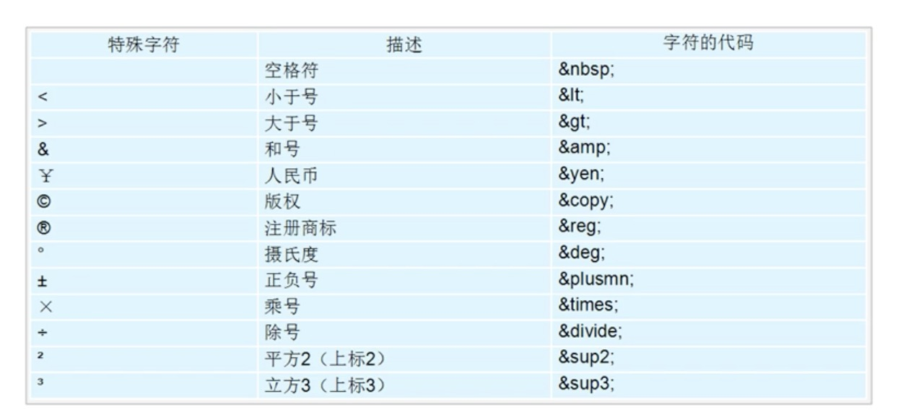
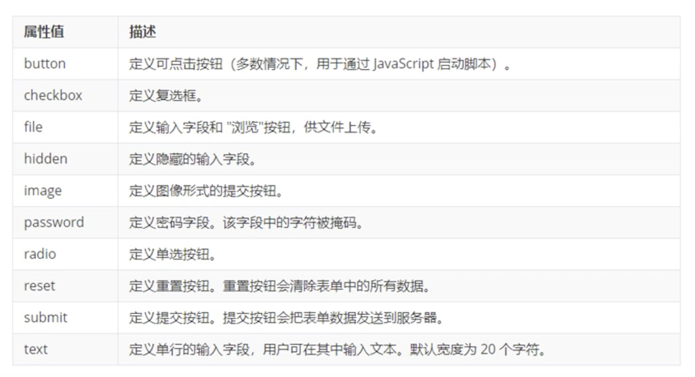

## 前置概念

- 网站：网页的集合

- 网页：网站中的一“页”，通常用html来编码，使用浏览器来阅读

- 网页是构成网站的基本要素，网页一般由图片、文字、视频、链接等构成

- HTML：超文本标记语言(Hyper Text Markup Language)，描述网页中的语言

  - 关于超文本的理解
    - 可以加入图片、音频、视频等，超越了文本的限制
    - 可以从一个文件跳转到另一个文件（超级链接文本）
  - 不是编程语言，只是一种标记语言

- 常用浏览器及内核

  - IE                      Trident      
  - 火狐(FireFox)   Gecko 
  - 谷歌（Chrome） Blink      Blink是Webkit的分支
  - Safari  Webkit
  - Opera  Blink
  - 内核作用：渲染引擎，读取文件，将文件内容显示到页面上

- web标准  

  - W3C(万维网组织)
  - 为什么需要？  因为不同浏览器内核不同，展示的内容可能不同，因此需要标准进行统一
  - 构成
    - 结构(Structure)    对HTML标签进行整理和分类
    - 表现(Presentation)    颜色、大小、展示===>css
    - 行为(Behavior)   交互 ===> JS

  

  

  ## HTML

  - 基本上标签都是成对出现的，开始标签+结束标签(多一个/)

  - 单标签

    - 换行 <br />
    - 图像标签
    - input表单输入
    - link标签
    - 文档类型声明<!DOCTPYE html>  采用HTML5版本显示网页
    - 当前文档的显示语言<html lang=''>  无所谓，中英文都能显示
      - 英语 en  
      - 中文 zh-CN
    - 字符集<meta charset="UTF-8">  GB2312(简体中文)、BIG5(繁体中文)、GBK(包含简体、繁体)

  - ```html
    <html>
      <head>
        <title>"犇仔的网页"</title>   
      </head>
      <body>
        网页的主体部分
      </body>
    </html>
    ```

  

  ## 标签

  ### 标题标签 (h1 ---- h6)

  ```
  <h1> xxxx </h1>   加了标题标签，就显得非常重要，字体会变得更粗更大，标题占一行
  ```

  ### 段落标签、换行

  ```
  <p>xxx</p>   paragraph的缩写   把文字分成段落
  <br />  brwak的缩写  换行   /加不加都行
  ```

  - 在文字中的多个空格其实没用，只会显示一个空格

  ### 文本格式化

  - 加粗、倾斜、删除线、下划线
  - 语义：突出重要性，比普通文字重要

  | 语义   | 标签                       | 说明                                |
  | ------ | -------------------------- | ----------------------------------- |
  | 加粗   | <strong></strong>或<b></b> | 推荐用<strong></strong>，语义更强烈 |
  | 倾斜   | <em></em>或<i></i>         | 推荐用<em></em>                     |
  | 删除线 | <del></del>或<s></s>       | 推荐用<del></del>                   |
  | 下划线 | <ins></ins>或<u></u>       | 推荐用<ins></ins>                   |

  ### div和span

  - 没有语义，普通的盒子用来装内容，起布局的作用
  - div是divsion的缩写，分割，分区  --- 一行只能放一个div    大盒子
  - span是跨度，跨距   ----横着显示   小盒子

  ### 图像标签img

  - src、alt(图片无法正常显示时的替换文本)、title(鼠标放在图片上时显示的文字)、width(像素)、height(像素)、border(边框粗细,像素)
  - 正常只需要修改宽度或者高度中的一个，会自动等比例缩放

  ```
     src是必须属性，指定文件路径和图片名
  ```

  ### 超链接标签

  ```
  <a  href="跳转目标"  target="目标窗口的弹出方式">文本或图像</a>   anchor的缩写，锚
  ```

  - href是必须属性，target默认值是_self当前页面打开,__blank在新窗口打开
  - 链接分类
    - 外部链接
    - 内部链接
    - 空链接   href="#"
    - 下载链接(链接的是文件，.exe或.zip等文件)
    - 网页元素链接，除了文字，图片、音频、视频等都可以加链接
    - 锚点链接，点击链接，可以快速定位到页面中某个位置  
      - href="#名字"  名字随便取   
      - 找到目标位置标签，添加id属性，id="名字"

  ### 注释标签和特殊字符

  ```
  <!--   -->  注释  快捷键cmd+/
  ```

  特殊字符

  

### 表格

- 显示、展示数据

```
<table>
	<tr>   ---定义表格中的行
		<td>xxx</td> --定义行中单元格
	</tr>
</table>
```

- 表头单元格 ---突出第一行 table head的缩写  可以把td换成th，区别在于会加粗、居中
- 表格属性，不常用，基本都是通过CSS来设置

| 属性名      | 属性值              | 描述                                  |
| ----------- | ------------------- | ------------------------------------- |
| align       | left、center、right | 相对周围元素的对齐方式                |
| border      | 1或“ ”              | 单元格是都有边框                      |
| cellpadding | 像素值              | 单元边沿与其内容之间的空白，默认1像素 |
| cellspacing | 像素值              | 单元格之间的空格，默认2像素           |
| width       | 像素或百分比        | 表格宽度                              |
| height      | 像素或百分比        | 表格高度                              |

- 表格结构标签
  - thead
  - tbody
- 合并单元格
  - 跨行合并  rowspan=“合并单元格的个数”
  - 跨列合并  colspan="合并单元格的个数"

### 列表

- 用来布局
- 无序列表、有序列表、自定义列表

```
无序列表   ul里面只有li标签   li可以放任何元素，相当于一个容器
<ul>
	<li>itme1</li>
	...
</ul>


有序列表
<ol>
	<li>item1</li>
	...
</ol>


自定义列表
<dl>
	<dt>名词1</dt>
	<dd>名词1说明1</dd>
	<dd>名词1说明2</dd>
/dl>
```


### 表单

- 表单域 ，用于将用于信息提交到服务器

  ```
  <form action="url地址" method="提交方式" name="表单域名称">
  </form>
  ```

- 表单控件

  - input输入、select下拉、textarea文本域

  ```html
  <input type="xxx">
  ```

  input表单type属性值

  

  input的name和value属性值，checked、maxlength

  - 单选按钮表单控件必须要有同一个name值才能实现多选一的效果，复选框也是
  - name、value一般都要有，提供给后套
  - checked只要针对单选框、复选框，默认控件处于选中状态  checked="checked"
  - maxlength约束表单输入的最大字符，用的比较少，一般用正则限制

- label标签   ------和input一起用

  - 可以绑定一个表单元素，当点击<label>标签中的文字时，浏览器将自动转到对应的表单元素上，增强用户体验
  - <label for="表单控件name">文字</label>   对应表单控件的id属性

- select下拉

  - select中至少包含一对option
  - 可以在option定义selected="selected"，当前项为默认项

  ```
  <select>
  	<option>...</opyion>
  	<option>...</option>
  	....
  </select>
  ```

- textarea文本域

  - 多行文本输入的控件，比如留言板、评论、简介
  - cols 每行字符数      
  - rows  显示的行数

  ```
  <textarea>
  	
  </textarea>
  ```

  

- 提示信息

